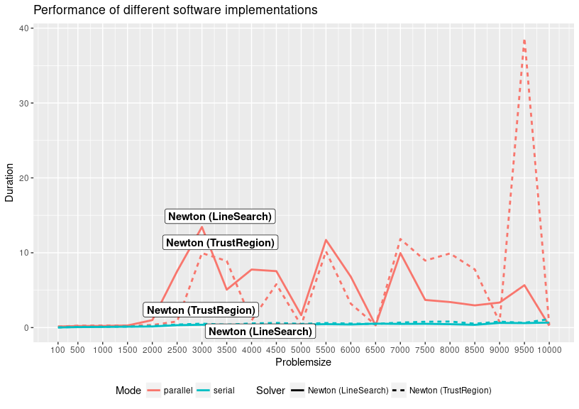

Performance Comparisons of Nonlinear Solver
===========================================

This is part of an ongoing project at university, where I try to find efficient ways to solve large nonlinear systems. More exactly, large nonlinear systems that may originate from a CGE (Computable General Equilibrium) Model in economics.

With *n* = 3000, the parallel version has trouble to find the right step-size (with the Newton line search solver), but the Newton trust region solver is slightly faster.
